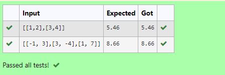

# 2-Norm of a matrix
## Aim
To write a program to find the 2-norm of the matrix and display the result in two decimal places.
## Equipment’s required:
1.	Hardware – PCs
2.	Anaconda – Python 3.7 Installation / Moodle-Code Runner
## Algorithm:

### Step 1:
Start Program

### Step 2:
Get the input matrix using np.array()

### Step 3:
The 2-Norm of a matrix is given by 

    
### Step 4:
Find the 2-norm of the matrix using np.linalg.norm()

### Step 5:
Print the norm of the matrix in two decimal places.

### Step 6:
End Program

## Program:
~~~
Program to find 2-norm of a matrix.
Developed by: Sarankumar J
RegisterNumber: 21500780

import numpy as np

mat = eval(input())
ans = np.linalg.norm(mat,2)
print("{:.2f}".format(ans))

~~~
## Sample Input and Output:

## Result
The program for 2-norm of a matrix is written and verified.
